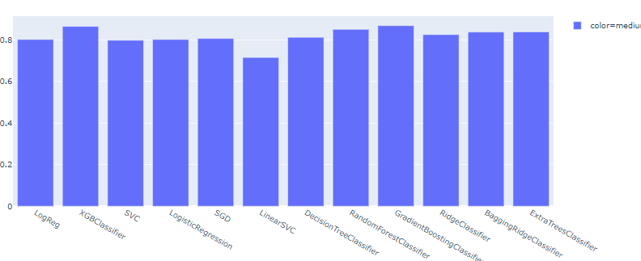
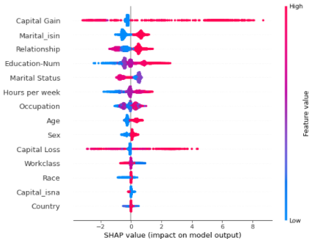

### 事前探索からの理解  
なお、図示結果に関してはノートブックを参照すること  
* 約８割が年収５００万以下であること
+ 500万以上には中年層の割合が高い
+ 若年層に低所得が多いこと
+ 教育レベルに応じて目的変数との正相関がみられる
+ 教育レベルが１５を超えると平均値が大幅に増加している
+ 各年齢層、教育レベルに顕著な差は見られない
+ 男性が女性の２倍以上大きい
+ 結婚状態１，２のカテゴリーが平均値高い
+ Relationshipの4には男性が集中、5には女性が集中している
+ Relationshipが４以上で平均値の増加  

### ベースデータでのモデルの評価値  

### 予測後モデルからの理解
決定木によるロス値からの特長量とシャープ値による特長量では多少異なる結果になる  
テストデータのシャープ値を使って寄与率からの解釈を読み取る  

+ Capital Gainのブレ幅が大きく、寄与影響は大きいが分類を決定づけできない
+ 教育レベルにより寄与が大きく変わる
+ 結婚状態1, 2により寄与が大きく変わる
+ Marital_isin/Relationshipの大小に強い交互作用がある
+ 中年層では男性が、若年層では女性がそれぞれ寄与が高い